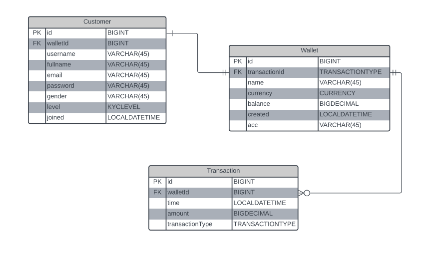

# Clane_EWallet-Api_Task

Implement e-wallet with REST API to create it, top it up, check its balance and withdraw funds using Spring (preferably Spring Boot). Funds on any wallet should
not go below zero. The project should be built with Maven.

### Starting And Making Use Of The APP:
In order to successfully utilize all the endpoints, the user must be successfully logged into the system due to the spring boot security checks.
A token is being generated on login which is added to the authorization section of the swagger-ui.

### Kyc Levels And Transaction Limits:
On registration of a new user a wallet is being generated which has a default Transaction Limit of 20,000NGN on a Kyc Level of NORMAL.
An endpoint is made available for an account upgrade from NORMAL to PREMIUM which increases the transaction limit to about 100,000NGN per transaction.

### Account TopUp and withdrawal:
This E-wallet has no limit for top-up transactions but has limits for withdrawal. you can Top-Up by providing your account number, amount and your walletId.
A user can only make a withdrawal transaction in accordance to his transaction limits.

### Sending Funds Or Making a Transfer:
Due to the business logic. A logged in user can only transfer funds from his own wallet into another user through email and wallet account number.
This transfer can not exceed the transaction limit for this particular user.

### Checking Users Profile:
A logged in user can view his profile which contains his balance and acc number and he can also view another customers profile by looking him up through his email but there are restrictions to what he can see.
the balance of the user and the id of this user is hidden from him

